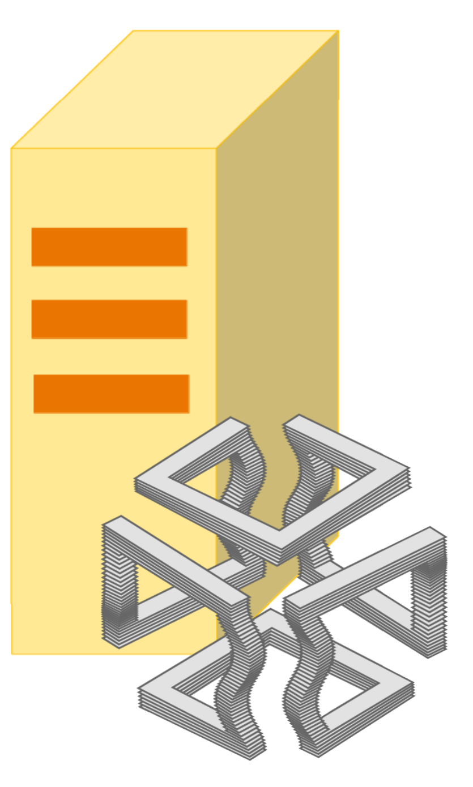

<div id="top"></div>

[![Contributors][contributors-shield]][contributors-url]
[![Forks][forks-shield]][forks-url]
[![Stargazers][stars-shield]][stars-url]
[![Issues][issues-shield]][issues-url]


<br />
<div align="center">
  <a href="https://github.com/mattianeroni/server-side-algorithms-doc">
    
  </a>
  
  <h1 align="center">Server Side Algorithms</h1>
  
  <p align="justify">
    Server Side Algorithms (SSA) is a platform with the objective to cover the gap between applications developers and scientists. Through a standard API described in our documentation (a link will be available soon), the registered developers are allowed to send HTTP requests to our server by requiring the execution of a specific algorithm on the provided data. These requests will be processed in real time and there is no limit to the number of requests a registered user can make. 
  </p>
  <p align="justify">
    In this way, developers with no scientific background have the opportunity to incorporate in their own applications complex algorithms and procedures, which have been developed by the experts of the sector and reviewed by our representatives.
  </p>
  <p align="justify">
    On the other hand, scientists with a solid background in algorithms, high-performance computing, combinatorial optimization, machine learning, and many other fields, can upload on the platform their implementations. In this way, they will gain visibility and will have the opportunity to earn from the platform safely and without any need to incorporate their algorithms in an application or spend time in the development of a user interface.
    <br />
    <br />
    <a href="https://github.com/mattianeroni/server-side-algorithms-doc"><strong>View Web Site</a>
    <br />
  </p>
</div>


## Table of contents

- [About The Project](#about-the-project)
  - [Why Server Side Algorithms](#why-server-side-algorithms)
  - [Built With](#built-with)
- [Usage](#usage)
  - [Prerequisites](#prerequisites)
  - [Installation](#installation)
  - [Examples](#examples)
- [Content](#content)
- [Contact](#contact)
- [Acknowledgments](#acknowledgments)


## About The Project

[![Product Name Screen Shot][product-screenshot]](https://example.com)


### Why Server Side Algorithms


Server Side Algorithms (SSA) is a self-maintained project. The initial service will be very basic, but we have intention to provide a more accurate documentation, and a more and more powerful server as the number of users increase. 
  
You can find our documentation at the following link: (soon available). 


<p align="right">(<a href="#top">back to top</a>)</p>


### Built With

* [FastAPI](https://fastapi.tiangolo.com/)

<p align="right">(<a href="#top">back to top</a>)</p>


## Usage

This is an example of how you may give instructions on setting up your project locally.
To get a local copy up and running follow these simple example steps.

### Prerequisites

* FastAPI
  ```sh
  pip install fastapi
  ```

### Installation

1. Get a free API Key at [https://example.com](https://example.com)
2. Clone the repo
   ```sh
   git clone https://github.com/mattianeroni/server-side-algorithms-doc.git
   ```
3. Install NPM packages
   ```sh
   npm install
   ```
4. Enter your API in `config.js`
   ```js
   const API_KEY = 'ENTER YOUR API';
   ```
   
<p align="right">(<a href="#top">back to top</a>)</p>


### Examples
   

<p align="right">(<a href="#top">back to top</a>)</p>


<!-- ROADMAP -->
## Content

- [ ] Feature 1
- [ ] Feature 2
- [ ] Feature 3
    - [ ] Nested Feature

See the [open issues](https://github.com/github_username/repo_name/issues) for an accurate description of proposed features.

<p align="right">(<a href="#top">back to top</a>)</p>


## Contributing

Contributions are what make the open source community such an amazing place to learn, inspire, and create. Any contributions you make are **greatly appreciated**.

If you have a suggestion that would make this better, please fork the repo and create a pull request. You can also simply open an issue with the tag "enhancement".
Don't forget to give the project a star! Thanks again!

1. Fork the Project
2. Create your Feature Branch (`git checkout -b feature/AmazingFeature`)
3. Commit your Changes (`git commit -m 'Add some AmazingFeature'`)
4. Push to the Branch (`git push origin feature/AmazingFeature`)
5. Open a Pull Request

<p align="right">(<a href="#top">back to top</a>)</p>


## Contact


Mattia Neroni, Ph.D., Eng. - mneroni@unimore.it - LinkedIn: [mylinkedin]

Project Link: https://github.com/mattianeroni/server-side-algorithms-doc

<p align="right">(<a href="#top">back to top</a>)</p>


## Acknowledgments


This project is completely self maintained.

<p align="right">(<a href="#top">back to top</a>)</p>


<!-- MARKDOWN LINKS & IMAGES -->
<!-- https://www.markdownguide.org/basic-syntax/#reference-style-links -->
[contributors-shield]: https://img.shields.io/github/contributors/mattianeroni/server-side-algorithms-doc.svg?style=for-the-badge
[contributors-url]: https://github.com/mattianeroni/server-side-algorithms-doc/graphs/contributors
[forks-shield]: https://img.shields.io/github/forks/mattianeroni/server-side-algorithms-doc.svg?style=for-the-badge
[forks-url]: https://github.com/mattianeroni/server-side-algorithms-doc/network/members
[stars-shield]: https://img.shields.io/github/stars/mattianeroni/server-side-algorithms-doc.svg?style=for-the-badge
[stars-url]: https://github.com/mattianeroni/server-side-algorithms-doc/stargazers
[issues-shield]: https://img.shields.io/github/issues/mattianeroni/server-side-algorithms-doc.svg?style=for-the-badge
[issues-url]: https://github.com/mattianeroni/server-side-algorithms-doc/issues
[mylinkedin]: https://www.linkedin.com/in/mattia-neroni-081965101/
[product-screenshot]: images/screenshot.png
